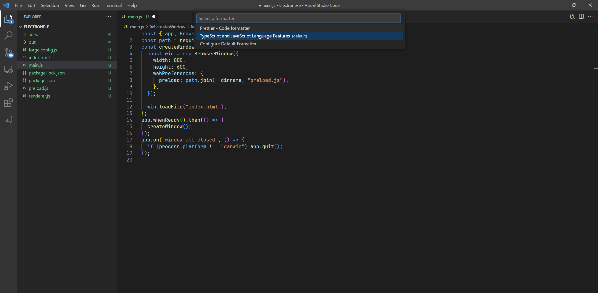

# 无锡

> [无锡项目脚手架](http://10.18.37.31:8081/NJ38/xxyy-web-init)

## 项目结构

```bash
public # 静态资源, 打包的时候会被复制到dist目录下, 且不会被编译
    favicon.ico  # 网站图标
src # 源码目录
    api # 接口请求
    assets # 静态资源  这里的资源会被编译
    components # 全局公共组件, 项目配置别名, 使用的时候, 可以直接 @components/xxx
    directive # 全局指令
    mixins # 全局混入
    mock # mock数据  目前没用
    router # 路由
    store # vuex 全局的状态管理
    utils # 工具函数 
    view # 页面
    App.vue # 根组件
    index.scss # 全局样式
    main.js # 入口文件
    permission.js # 权限控制
.env.development # 开发环境变量
.env.production # 生产环境变量
.eslintrc.js # eslint配置 eslint会让代码规范化, js本身是弱类型语言, 代码风格不统一, 会导致代码难以维护, 而且可以发现很多开发环境出现的错误
.gitignore # git忽略文件 
index.html # html 主入口文件
jsconfig.json # jsconfig配置 用于vscode智能提示, 比如@代表src
package.json # 依赖
README.md # 项目说明
vite.config.js # vite配置
```

## 项目规范

### 使用eslint规范项目, 安装vscode的eslint插件,或者启用idea的eslint插件

#### vscode


#### idea


### 为了避免代码格式化冲突,推荐使用prettier, 安装vscode的prettier插件,或者启用idea的prettier插件

#### vscode




#### idea


## 从0到1

1. 脚手架新建项目
2. 权限系统中配置应用
    1. 
    1. 
    1. 
    1. 

3. 接入后台

判断.env文件中的VITE_APP_BASE_API和VITE_APP_BASE_API_LIST是否正确,如果VITE_APP_BASE_API_LIST没有这个应用, 则需要添加这个应用

4. 让李总配置nginx

在测试和正式环境中, 需要配置nginx, 把前端的请求代理到后台

## 启动项目

1. `npm  install` 安装依赖
2. `npm run dev` 启动项目
3. 端口冲突,修改端口时候: `vite.config.js`中的`port`字段
4. [有wddp-affair-main包的时候](#wddp-affair-main)

## 功能

### 如何请求后台接口

1. 在`src/api`目录下新建一个文件, 如`user.js`
2. 在`user.js`中定义接口请求函数, 如:

```js
import request from '@/utils/request'

export function getInfo() {
    return request({
        url: '/api/getUser',  // 这里api是代理的别名
        method: 'post',
    })
}
```

3. 在需要调用接口的地方引入, 如:

```js
  import {
    getUserInfo
} from '@/api/index/sso.js'

getUserInfo(token, appToken).then(res => {

})
````

#### 选择服务

在.env中声明了VITE_APP_BASE_API和VITE_APP_BASE_API_LIST, 用于区分不同的服务, 在请求接口的时候, 可以选择不同的服务

```
# 接口项目
VITE_APP_BASE_API = '/yzjggl'  api接口前缀, 默认为/yzjggl

#其他应用的接口上下文（用逗号隔开，冒号前为前端接口中的添加，冒号后为接口ngx配置）
VITE_APP_BASE_API_LIST = "xxyy-auth:auth,xxyy-yzjggl:yzjggl"
```

### 如何注册一个页面

1. 新建vue文件
2. 权限系统中配置路由
   
3. 权限系统中配置权限
   
4. 如果用到接口,需要在页面下,配置接口权限
   

::: tip
一般路由和组件路径一致,方便查找,为了避免重复代码,可以把公用代码提取
:::

#### 获取当前路由

```js
import {useRoute} from 'vue-router'

const route = useRoute()
console.log(route)
```

#### 通过params区分页面


```js
import {useRoute} from 'vue-router'

const route = useRoute()
console.log(route.params)
```

#### 如果想路由在白名单,不需要权限

::: tip
不需要在权限系统中声明了,因为这里的路由配置在前端,是静态的
:::

1. 在router/index.js中配置固定路由
   
2. 在permission.js中配置白名单
   

## 坑

1. 想要引用public下的资源, 不要在源代码中出现 `public`, 直接使用 `/` 开头的绝对路径, 如: `/favicon.ico`
2. 安装依赖的时候,最好根据lock文件安装,不然可能会出现版本不一致的问题,导致项目无法启动
3. `wddp-affair-main` 的安装: { #wddp-affair-main }
    1. 删掉`package.json`中的`"dependencies": {wddp-affair-main:""}`
    1. `npm i`
    1. `npm run affair`

## 注意

### 请求中的别名

> 在请求接口的时候, 可以使用别名, 如: `@/api/getUser`, 这个别名是在`vite.config.js`中配置的

::: tip
只有在开发环境中才能使用别名, 在生产环境中, 会被替换成真实路径, 请求后台接口, 靠的是nginx做代理
:::

```js
export default {
    server: {
        host: true,
        //open: true,
        https: false,
        proxy: {
            "/yzjgg": {
                target: "http://localhost:9000/wdls-yzjggl",
                // target: "http://yzjggl.wxyl.com/yzjggl", //测试环境
                // target: "https://yzjggl.wuxixxyy.cn/yzjggl",//正式环境屮
                changeOrigin: true,
                ws: true,
                rewrite: (p) => p.replace(/^\/yzjggl/, "")  // 把yzjgg替换掉,比如 http://localhost:3000/yzjgg/api ->  http://localhost:9000/wdls-yzjggl/api
            },
            // 代理auth服务
            "/auth": {
                //target: "http://localhost:8000/wdls-gateway/auth-service",
                target: "http://zwpt.wxyl.com/auth", //网关测试环境
                // target: "https://zwpt.wuxixxyy.cn/auth",//政务云环境
                changeOrigin: true,
                ws: true,
                rewrite: (p) => p.replace(/^\/auth/, ""),  // 把auth替换掉,比如 http://localhost:3000/auth/api ->  http://zwpt.wxyl.com/auth/api
            },
        },
    }
}
```

### 前端中的promise

[阮一峰的es6教程-promise](https://www.bookstack.cn/read/es6-3rd/spilt.1.docs-promise.md)

### 项目中的路由

#### 静态路由

配置在`router/index.js`中, 一般是固定的,不会变化

#### 动态路由

配置在权限系统中,通过接口获取, 一般是根据权限动态生成的, 根据menus的components和path生成

```js
// src/premission.js
let modules = import.meta.glob("@/view/page/**/*.vue")  // 获取所有的页面
//根据菜单动态生成路由
const CompilerMenu = (arr) => {
    if (!arr.length) {
        return;
    }
    arr.forEach((item) => {
        if (!item.children || (item.children && item.children.length === 0)) {
            if (item.component) {
                let module = modules[`/src/view/page${item.component}` + '.vue']
                if (module) {
                    let rts = {
                        path: item.path,
                        meta: {title: item.name, keepAlive: true, key: item.menuId},
                        name: item.path,
                        component: module
                    };
                    router.addRoute('index', rts)
                }
            }
        }
        if (item.children && item.children.length) {
            CompilerMenu(item.children);
        }
    });
}
```

### 项目默认px转rem, 如果不需要

> file 指的路由的路径


```js
// 在vite.config.js中添加
postCssPxToRem({ // 自适应，px>rem转换
    rootValue: 192.0, // 1rem的大小
    propList: ['*'], // 需要转换的属性，这里选择全部都进行转换
    exclude: function (file) {
        // '/operational-sign','/old-people','/service-catalog','/service-facility','/service-staff'
        // 排除node_modules文件夹下的文件
        return file.indexOf('node_modules') !== -1 ||
            file.indexOf('/big-screen-wx') !== -1 ||
            file.indexOf('/operational-sign') !== -1 ||
            file.indexOf('/operational-sign-home') !== -1 ||
            file.indexOf('/operational-sign-detail') !== -1 ||
            file.indexOf('/old-people') !== -1 ||
            file.indexOf('/service-catalog') !== -1 ||
            file.indexOf('/service-facility') !== -1 ||
            file.indexOf('/service-facility-fwyyqk') !== -1 ||
            file.indexOf('/service-facility-fwyyqk-index') !== -1 ||
            file.indexOf('/service-facility-fwyyqk-yzfw') !== -1 ||
            file.indexOf('/service-facility-fwyyqk-zcfw') !== -1 ||
            file.indexOf('/service-facility-fwyyqk-ylfw') !== -1 ||
            file.indexOf('/service-facility-fwyyqk-shhfw') !== -1 ||
            file.indexOf('/service-staff') !== -1 ||
            file.indexOf('/service-staff-distribution') !== -1 ||
            file.indexOf('/service-staff-position') !== -1
    }
})
```   
